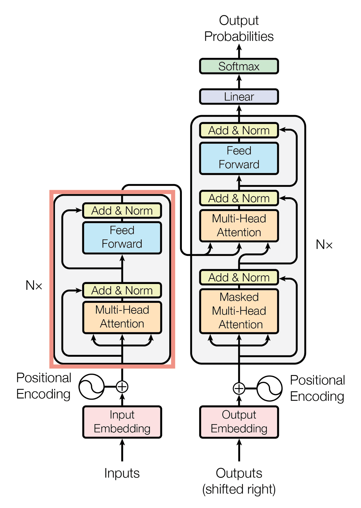

# GPT from Scratch

This repository chronicles a hands-on journey to build a Generative Pre-trained Transformer (GPT) model from scratch using PyTorch, heavily inspired by Andrej Karpathy's insightful "Let's build GPT" lecture series. The project progresses incrementally, starting from a rudimentary Bigram Language Model and evolving into a more sophisticated transformer architecture, illustrating fundamental concepts and essential optimizations.



## Files Overview

- **`gpt-from-scratch.ipynb`**: This Jupyter Notebook serves as the primary educational resource, guiding the user through the entire development process. It covers data loading, tokenization, model construction (from Bigram to Transformer), training, and text generation, with detailed explanations and executable code snippets at each stage.

- **`bigram.py`**: Implements the most basic Bigram Language Model. This foundational script demonstrates how to predict the next character based solely on the preceding one, providing a simple baseline for character-level language modeling.

- **`bigram_v2.py`**: An enhanced version of the Bigram model. This script introduces the crucial concepts of token and positional embeddings, allowing the model to understand both the identity and order of characters. It also incorporates a single head of self-attention, marking the initial step towards a transformer architecture.

- **`bigram_v3.py`**: Further evolves the model by integrating Multi-Head Attention and a Feed-Forward network. These components, combined, form a rudimentary transformer block, demonstrating how multiple attention mechanisms can process information in parallel and how feed-forward layers can further refine representations.

- **`bigram_v4.py`**: Represents a more advanced iteration, incorporating critical optimizations essential for training deep neural networks. This version includes:
  - **Residual Connections**: To facilitate gradient flow and enable deeper models.
  - **Layer Normalization (`nn.LayerNorm`)**: To stabilize training by normalizing inputs to each layer.
  - Increased `block_size` and `n_embed` hyperparameters, reflecting a move towards a more capable model.
  - Dropout for regularization.

- **`tinyshakespeare/input.txt`**: The dataset utilized for training and evaluating all language models in this repository. It contains a collection of Shakespeare's works, providing a rich text corpus for the models to learn character-level sequence patterns.

## Key Concepts Demonstrated

This repository provides practical implementations and insights into several core concepts in natural language processing and deep learning:

- **Data Preparation & Tokenization**: Techniques for loading raw text data, creating character-to-integer mappings (`stoi`) and integer-to-character mappings (`itos`), and preparing data into batches for efficient model training.
- **Bigram Language Modeling**: A fundamental approach to probabilistic language modeling.
- **Embeddings**: Understanding and implementing token embeddings (for semantic representation) and positional embeddings (for sequence order).
- **Self-Attention Mechanism**: The cornerstone of transformer models, detailing how queries, keys, and values interact to create context-aware representations. This includes:
  - The role of Query, Key, and Value vectors.
  - Scaled Dot-Product Attention for stabilized weight calculation.
  - Causal (Masked) Attention using a triangular mask (`tril`) for autoregressive generation.
- **Multi-Head Attention**: Scaling attention by allowing the model to jointly attend to information from different representation subspaces.
- **Feed-Forward Networks**: Standard neural network layers applied after attention for further processing.
- **Transformer Blocks**: The modular building blocks of transformers, combining Multi-Head Attention and Feed-Forward networks.
- **Optimizations for Deep Networks**: Practical implementation of residual connections, Layer Normalization, and Dropout to enable stable and effective training of deep models.
- **Training Loop**: A complete PyTorch training loop including optimizer (AdamW), loss function (Cross Entropy), backpropagation, and gradient updates.
- **Text Generation**: Using the trained models to sample new sequences of text, demonstrating their ability to "babble" based on learned patterns.

## Model Architecture Details

The implementation built in this repository is specifically a **decoder-only Transformer** because its primary goal is unconditioned text generation, meaning it is designed to simply "babble" or imitate a single dataset (like Shakespeare) without needing to respond to or translate an external input prompt.

Here are the key points defining this architecture and what it specifically omits compared to the original design:

**1. The Triangular Mask**
The defining functional feature that makes this a decoder is the use of a **triangular mask** within the self-attention mechanism. This mask blocks future tokens from communicating with past tokens, ensuring that the model can only use historical context to make its predictions. This enforces an auto-regressive property, which is required for sampling and generating text sequentially.

**2. Missing the Encoder Block**
The original 2017 "Attention Is All You Need" architecture was designed for machine translation (e.g., translating French to English) and therefore utilized an **Encoder-Decoder** structure. The encoder's job was to read the source language and allow all tokens to communicate fully with each other without any masking. Since the implementation in the video only generates text from a single source and does not translate or interpret a secondary source text, the encoder block is omitted entirely.

**3. Missing the Cross-Attention Block**
Because there is no encoder, the model also completely lacks a **cross-attention block**.

- In **self-attention** (which this model uses exclusively), the Queries, Keys, and Values are all generated from the exact same internal source.
- In **cross-attention**, the model fuses two different sources of information. The **Queries** are generated by the decoder's current position, but the **Keys and Values** are pulled in from the side—specifically, from the output nodes of the encoder.

This cross-attention mechanism is what traditionally allows a decoder to condition its text generation on the fully encoded source material. Because the video's GPT model has no external context to condition its outputs on, the cross-attention block is unnecessary and is not included.

## How to Run

To run the Python scripts or the Jupyter Notebook, ensure you have Python and PyTorch installed.

**For Python Scripts:**
Navigate to the repository's root directory in your terminal and execute any of the Python files directly:

```bash
python bigram_v4.py
```

(Note: `bigram_v4.py` is configured to utilize a GPU if available. Ensure you have a compatible CUDA-enabled GPU and PyTorch with CUDA support installed for optimal performance.)

(Replace `bigram_v4.py` with the desired script name.)

**For Jupyter Notebook:**
Open `gpt-from-scratch.ipynb` in a Jupyter environment (e.g., Jupyter Lab, VS Code with Jupyter extension) and run the cells sequentially.

## Dataset

The `tinyshakespeare/input.txt` file is included in the repository, so no additional data download steps are required if the repository is cloned as is.
